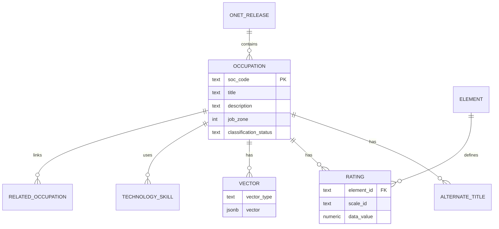

# O*NET Export Schema

```mermaid
erDiagram
  ONET_RELEASE ||--o{ OCCUPATION : contains
  OCCUPATION ||--o{ ALTERNATE_TITLE : has
  OCCUPATION ||--o{ RATING : has
  OCCUPATION ||--o{ VECTOR : has
  OCCUPATION ||--o{ TECHNOLOGY_SKILL : uses
  OCCUPATION ||--o{ RELATED_OCCUPATION : links
  ELEMENT ||--o{ RATING : defines

  OCCUPATION {
    text soc_code PK
    text title
    text description
    int job_zone
    text classification_status
  }
  RATING {
    text element_id FK
    text scale_id
    numeric data_value
  }
  VECTOR {
    text vector_type
    jsonb vector
  }
```

## Classification rule
Only occupations with a **RIASEC vector** (`vector_type = riasec`) are exported as classified/accepted — aligned with the CareerGUIDE matching engine.
