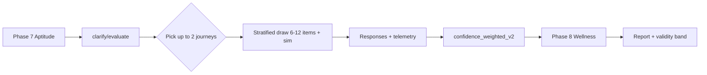

# MBS User Flow 6 — Clarification Phase Specification

**Phase ID:** 7.5  
**Placement:** After Phase 7 (Confirmatory Aptitude), before Phase 8 (Wellness)  
**Audience:** Fresher graduates, interns, first-year employees (20–25)  
**Version:** 1.0.0  

---

## Deliverables (file locations)

| Artifact | Path |
|----------|------|
| **Question bank (202 items)** | `backend/exports/archive/MBS_QBank_User_6_Clarification.json` |
| **Routing matrix** | `backend/exports/archive/MBS_Clarification_Routing_Matrix.json` |
| **Scoring matrix** | `backend/exports/archive/MBS_Clarification_Scoring_Matrix.json` |
| **Simulation library** | `backend/exports/archive/MBS_Clarification_Simulation_Library.json` |
| **Regenerator script** | `backend/exports/archive/scripts/generate-clarification-bank.mjs` |

---

## Journey inventory

| Journey | Name | Pool size | Session draw | Sim injections |
|---------|------|-----------|--------------|----------------|
| **J1** | Communication & EQ | 35 | 6–12 items | Read-the-Room |
| **J2** | Collaboration & Conflict | 35 | 6–12 items | Team Chat, Conflict Branch, Negotiation NPC |
| **J3** | Decision Making & Stress | 35 | 6–12 items | In-Tray Mini, Two Doors, Crisis Commander |
| **J4** | Integrity & Evidence Validation | 30 | 6–12 items | Honest Dice |
| **J5** | Career Path Clarification | 32 | 6–12 items | Trade-off Island |
| **J6** | Domain Readiness Validation | 35 | 6–12 items | Sector Match, Trend Radar, Tool Bench, Market Mover |

**Total pool:** 202 items  
**Max journeys per session:** 2  
**Rotation:** Stratified random; exclude last 5 seen items; balance difficulty.

---

## Item schema (every record)

```json
{
  "item_id": "CLAR-J1-01",
  "journey": "J1",
  "construct": "COMM-AUD|COMM-DIF|EQ-SR",
  "question_type": "SJT | forced-choice | ranking | affect-recognition | simulation-ref | allocation-game | multi-select | matching | overclaiming",
  "difficulty": "beginner | standard | stretch",
  "stem": "...",
  "options": ["...", "..."],
  "correct_answer": "0",
  "scoring_logic": "...",
  "anti_bias_rationale": "...",
  "follow_up_trigger": "...",
  "routing_rules": {}
}
```

**No work-readiness Likert.** Wellness (Phase 8) remains the only self-report screener.

---

## Scenario coverage

### J1 — Communication & EQ
- **Email:** manager vagueness, client anger, deadline pushback
- **Chat:** incident channels, peer offload requests
- **Manager:** feedback on quietness, vague praise
- **Client:** interruptions, tone repair
- **EQ:** affect reading ("Fine. Ship it."), empathic openers
- **Forced-choice / ranking:** ipsative communication style

### J2 — Collaboration & Conflict
- **Group projects:** architecture disagreements, story points, demo prep
- **Disagreements:** release with known bug, design deadlock, retro blame
- **Ownership:** production bugs, bad handoffs, on-call
- **Credit:** pair work attribution, stolen analysis
- **Conflict:** missed deadlines, vendor SLA, cross-team slips, escalation

### J3 — Decision Making & Stress
- **Prioritization:** in-tray mini rankings with trap items
- **Limited information:** partial analytics for board deck
- **Trade-offs:** launch vs delay, incident vs demo
- **Time pressure:** on-call, audit samples, budget cuts
- **Sim refs:** Two Doors telemetry, Crisis Commander waves

### J4 — Integrity & Evidence
- **Reporting mistakes:** undisclosed bugs, PII in logs
- **Resume inflation:** skills check honesty
- **Over-claiming:** planted fake concepts (ECO-D02 pattern)
- **Ethical dilemmas:** backdating, license violations
- **Honest Dice:** ground-truth vs reported roll

### J5 — Career Path
- **Stability vs growth:** enterprise vs startup offers
- **Specialist vs generalist:** IC vs manager track
- **Startup vs enterprise:** compliance friction
- **Trade-off Island:** Income / Learning / Stability / Impact tokens
- **Intrapreneur:** pilot without budget, ambiguous roles

### J6 — Domain Readiness (2026)
- **Sectors:** IT services/GCC, Fintech/BFSI, E-commerce/ONDC, Healthcare, Manufacturing
- **Tools:** Jira, SQL, GA4, ERP, EHR — matched to role
- **Compliance:** PAN/DPDP, PCI, public LLM policy
- **Trends:** GenAI, GCC shift, ONDC, telehealth, Industry 4.0
- **Data literacy:** small-n dashboard critique
- **AI adoption:** enterprise tool + redaction vs public LLM paste

---

## API integration (extends Intern Flow Spec §11)

```
POST /v6/session/{id}/clarify/evaluate  → journeys[], ambiguity_flags
GET  /v6/session/{id}/clarify/next      → block: items[] | sim_config
POST /v6/block/{id}/clarify/response    → ItemResponse + journey_id
POST /v6/session/{id}/clarify/finalize → ConstructScore fusion v2
```

---

## Session flow



---

## Regeneration

```bash
node backend/exports/archive/scripts/generate-clarification-bank.mjs
```

Edit templates in the script to add scenarios; re-run to refresh JSON artifacts.

---

## Pilot calibration targets

| Parameter | Initial value | Calibrate in pilot |
|-----------|---------------|-------------------|
| `construct_confidence_floor` | 0.65 | ±0.05 |
| `method_divergence_z` | 1.0 | ROC vs coach ratings |
| `in_tray_tau` trigger | 0.5 | Expert agreement |
| Items per session | 6–12 | Fatigue vs SE reduction |

---

## Related primary-flow assets

- `backend/exports/archive/MBS_UserFlow_User_6.json`
- `backend/exports/archive/Archive 2/MBS_QBank_User_6.json`
- `backend/exports/archive/MBS_Ecosystem2026_ItemBank.json`
